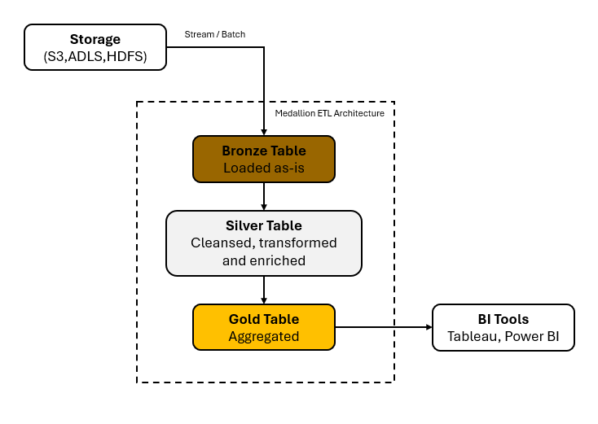

# Spark ETL Demo

This repo contains my Spark ETL Pipeline Demo



## Table of Contents

- [Installation](#installation)
- [Features](#features)

## Installation

To install and set up your project:

```bash
cd path/to/directory

git clone https://github.com/josephkohhh/Spark-ETL-Pipeline-Demo.git
```

## Folder structure
```
etl_demo/
├── config # store config files
├── ingestion # store ingestion packages
├── transformation # store silver transformation packages
└── load # store gold transformation packages
```
